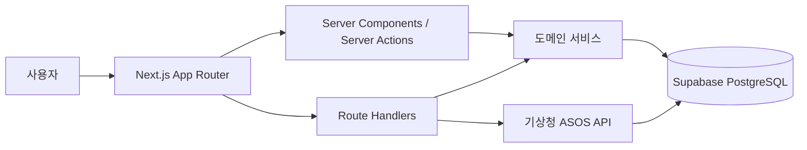

# Weather Board

날씨와 매출 데이터를 한 화면에서 확인하고, 매출 흐름을 다양한 기준으로 분석하는
대시보드입니다. 날짜별 매출을 기록하면 캘린더와 차트에서 월별·주별 추이, 결제수단별
매출, 전년 동월 비교와 날씨별 매출 성과를 확인할 수 있습니다.

## 주요 기능

### 매출 캘린더

- 날짜별 매출과 날씨를 월간 캘린더로 조회
- 이전 달과 다음 달을 이동하며 과거 내역 탐색
- 날짜와 결제수단을 기준으로 매출 등록 및 수정

### 매출 분석 대시보드

- 월 매출 합계, 일 평균 매출, 최고 매출일, 매출 성과가 높은 날씨 제공
- 일별 매출 추이와 주간 합계를 차트로 시각화
- 선택한 달과 전년도 같은 달의 총매출 비교
- 카드, 현금 등 결제수단별 매출 내역 집계

### 날씨 데이터 연동

- 기상청 지상(종관, ASOS) 일자료 API를 이용해 서울 지역의 날씨 데이터 동기화
- 아직 날씨가 연결되지 않은 매출일만 조회해 중복 요청 최소화
- 기온, 강수량, 습도, 운량을 저장하고 매출 데이터와 날짜 기준으로 결합

### REST API

- 매출 등록·조회·수정·삭제 및 월별 매출 조회
- 주간·월간 통계와 결제수단별 일 매출 조회
- 날씨별 월간 매출 추이 조회
- 요청 값 검증과 일관된 오류 응답 처리

## 기술적 의사결정: Next.js 통합

초기에는 `weather-board-backend`와 `weather-board-frontend`를 분리해 개발했습니다.
그러나 프로젝트의 기능 규모에 비해 서버와 클라이언트를 별도로 배포·관리하는 구조는
복잡도와 유지보수 비용을 불필요하게 높인다고 판단했습니다.

이에 사용자에게 제공하는 기능은 유지하면서 프론트엔드와 API를 하나의 Next.js
애플리케이션으로 통합했습니다. 화면의 초기 데이터는 Server Component에서 조회하고,
폼 처리는 Server Action으로, 외부에서 사용할 수 있는 API는 Route Handler로
구현했습니다. 그 결과 개발 환경과 배포 과정을 단순화하고, 기능 변경에 필요한 화면과
서버 코드를 하나의 저장소에서 함께 추적할 수 있게 되었습니다.

## 아키텍처



- UI와 데이터 요청을 같은 애플리케이션에서 관리하되, `app`, `lib`, `util`의 역할을
  분리해 화면·비즈니스 로직·공통 로직의 경계를 유지했습니다.
- 매출 통계는 원본 매출을 기준으로 조회 시 계산해 별도의 통계 테이블과 원본 데이터
  사이에서 발생할 수 있는 정합성 문제를 줄였습니다.
- 동일한 날짜와 결제수단의 매출에는 데이터베이스 복합 유니크 제약조건을 적용하고
  upsert 방식으로 저장해 중복 입력을 방지했습니다.
- 브라우저에 노출되면 안 되는 Supabase Service Role Key와 기상청 API Key는 서버
  환경에서만 사용합니다.

## 기술 스택

| 영역 | 기술 | 사용 목적 |
| --- | --- | --- |
| Framework | Next.js 16, React 19 | App Router 기반 풀스택 애플리케이션 구성 |
| Language | TypeScript | 정적 타입을 통한 데이터 계약 및 안정성 확보 |
| Database | Supabase, PostgreSQL | 매출·날씨 데이터 저장 및 조회 |
| Visualization | Chart.js, react-chartjs-2 | 일별·주별·전년 동월 매출 시각화 |
| Styling | Tailwind CSS 4, CSS | 반응형 레이아웃과 UI 스타일 구성 |
| External API | 기상청 공공데이터 API | 서울 지역 ASOS 일자료 수집 |

## 프로젝트 구조

```text
weather-board/
├─ app/
│  ├─ api/          # 매출·날씨·통계 Route Handlers
│  ├─ calendar/     # 월간 매출 캘린더
│  ├─ dashboard/    # 매출 분석 대시보드 진입점
│  ├─ screens/      # 페이지 단위 클라이언트 화면
│  ├─ ui/           # 차트, 모달, 테이블 등 공통 UI
│  └─ actions.ts    # 매출 저장 Server Action
├─ lib/             # DB 접근, 매출·날씨·통계 도메인 로직
├─ util/            # 날짜, 금액, 결제수단 관련 공통 함수
└─ supabase/
   └─ migrations/   # 데이터베이스 제약조건 마이그레이션
```

## 실행 방법

### 사전 준비

- Node.js 20.9 이상
- Supabase 프로젝트 및 `sale`, `weather` 테이블
- 기상청 공공데이터포털 서비스 키

### 설치 및 실행

```bash
git clone https://github.com/bigdaditor/weather-board.git
cd weather-board
npm install
```

프로젝트 루트에 `.env.local` 파일을 만들고 다음 값을 설정합니다.

```dotenv
NEXT_PUBLIC_SUPABASE_URL=your_supabase_project_url
SUPABASE_SERVICE_ROLE_KEY=your_supabase_service_role_key
KMA_SERVICE_KEY=your_kma_service_key
```

`SUPABASE_SERVICE_ROLE_KEY`는 데이터베이스 관리 권한을 가진 서버 전용 값입니다.
`NEXT_PUBLIC_` 접두사를 붙이거나 클라이언트 코드에서 참조하지 마세요.

개발 서버를 실행합니다.

```bash
npm run dev
```

브라우저에서 [http://localhost:3000](http://localhost:3000)에 접속합니다.

### 품질 확인

```bash
npm run lint
npm run build
```

## API

| Method | Endpoint | 설명 |
| --- | --- | --- |
| `GET` | `/api/sale?page=1&page_size=10` | 날짜별로 집계된 매출 목록 조회 |
| `POST` | `/api/sale` | 매출 등록 또는 동일 날짜·결제수단 매출 갱신 |
| `PATCH` | `/api/sale` | 날짜와 결제수단에 해당하는 매출 수정 |
| `DELETE` | `/api/sale` | 날짜와 결제수단에 해당하는 매출 삭제 |
| `GET` | `/api/sale/{saleId}` | ID로 매출 단건 조회 |
| `GET` | `/api/sale/month?key=YYYY-MM` | 선택한 달의 일별 매출 합계 조회 |
| `GET` | `/api/weather?month=YYYY-MM` | 선택한 달의 날씨 조회 |
| `POST` | `/api/weather` | 동기화되지 않은 매출일의 기상청 날씨 수집 |
| `GET` | `/api/statistics` | 기간과 결제수단 조건에 따른 통계 조회 |
| `GET` | `/api/statistics/summary/{periodType}` | 주간 또는 월간 통계 요약 조회 |
| `GET` | `/api/statistics/daily` | 결제수단별 일 매출 조회 |
| `GET` | `/api/statistics/weather/monthly` | 날씨 유형별 월간 매출 추이 조회 |
| `POST` | `/api/statistics/recompute` | 원본 매출 데이터의 통계 계산 가능 여부 검증 |

### 매출 등록 요청 예시

```http
POST /api/sale
Content-Type: application/json

{
  "input_date": "2026-07-21",
  "amount": 150000,
  "payment_type": "카드"
}
```

## 데이터 모델

| 테이블 | 주요 컬럼 | 역할 |
| --- | --- | --- |
| `sale` | `input_date`, `amount`, `payment_type`, `sync_status` | 날짜·결제수단별 매출과 날씨 동기화 상태 저장 |
| `weather` | `date`, `avg_temp`, `min_temp`, `max_temp`, `sum_rain`, `avg_humidity`, `summary` | 날짜별 기상 관측값과 날씨 분류 저장 |

`sale.input_date`와 `sale.payment_type`의 조합은 유일하며, 같은 조합으로 다시 등록하면
기존 매출이 갱신됩니다.
